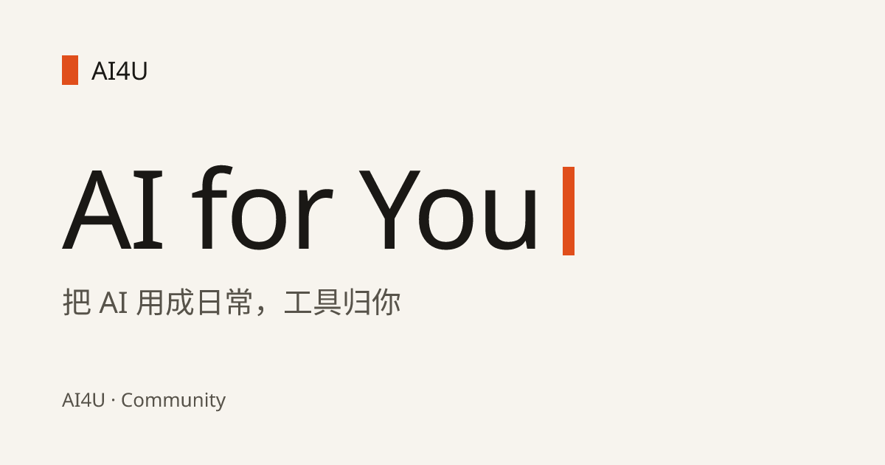
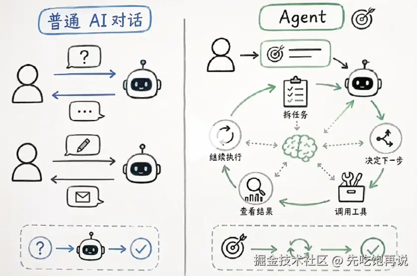

  把 AI 用成日常

  一伙人自己在维护的 AI 交流社区

  
  
  

## 这是什么

AI4U（**AI for You**）是一个面向所有对 AI 好奇的人的交流社区。

这里攒下来的是**自己动手做出来的东西**：怎么让 AI 真的把活干完，怎么从零做出一个能发给朋友的网站，怎么把 AI 用进日常办公。写下来的都是自己走过的路，不承诺你能学会什么，也不劝你买什么。

网站本身就是内容 👉 **[ravicc02.github.io/AI4U](https://ravicc02.github.io/AI4U/)**

## 目录

- [这是什么](#这是什么)
- [内容导航](#内容导航)
- [里面长什么样](#里面长什么样)
- [建议怎么读](#建议怎么读)
- [加入我们](#加入我们)
- [参与和反馈](#参与和反馈)
- [这个站是怎么做的](#这个站是怎么做的)

## 内容导航

目前公开三篇，都会持续更新：

| 内容 | 讲什么 | 大概要花 |
| :--- | :--- | :--- |
| [**Hello Agent**](https://ravicc02.github.io/AI4U/docs/what-is-agent/) | 从「一问一答」到「持续干活」：沿 LLM → Prompt → Tool → MCP → Agent → Skill 把十个核心概念串成一条链 | 25 分钟 |
| [**如何用 AI 创建并发布自己的网站**](https://ravicc02.github.io/AI4U/docs/build-website-with-ai/) | 从装客户端、配 Key、把 Agent 用明白，到弄懂前后端，最后把发布交给 Agent 自动化 | 25 分钟 |
| [**AI 提效办公**](https://ravicc02.github.io/AI4U/docs/ai-office-productivity/) | 从写好一条提示词，到按场景取用现成模板，最后拼成能持续运转的工作流 | 18 分钟 |

> 三篇都在网站里按阅读版式排版，带目录、阅读进度和上/下一篇 —— [去 /docs 看全部](https://ravicc02.github.io/AI4U/docs/)

## 里面长什么样

<table>
  <tr>
    <td width="100%" align="center" valign="top">
      
       
      普通对话是一问一答，Agent 是持续循环
    </td>
  </tr>
  <tr>
    <td width="100%" align="center" valign="top">
      
       
      把提示词按场景归好类，用的时候直接取
    </td>
  </tr>
</table>

## 建议怎么读

顺序没有硬规定，看你手头要解决什么：

- **完全没接触过** → 先看 [Hello Agent](https://ravicc02.github.io/AI4U/docs/what-is-agent/)，把几个名词认全，后面会顺很多
- **想做个自己的网站** → [如何用 AI 创建并发布自己的网站](https://ravicc02.github.io/AI4U/docs/build-website-with-ai/) 可以跟着一步步走
- **只想让日常的活快点干完** → [AI 提效办公](https://ravicc02.github.io/AI4U/docs/ai-office-productivity/) 里挑一个你最烦的场景试

## 加入我们

东西是公开的，人聚在微信群里，聊教程里的问题、踩坑和随手分享。

群二维码有有效期，过期了就在[本仓库开个 issue](https://github.com/ravicc02/AI4U/issues/new) 说一声，我们换一张。

## 参与和反馈

- 教程哪里写错了、跟不上了 → [开个 issue](https://github.com/ravicc02/AI4U/issues/new)，说清是哪一篇哪一段
- 你有更好的做法 → 欢迎提 PR，也欢迎先发在群里聊
- 网站本身的毛病（排版、动效、无障碍）也都在这个仓库里，一样开 issue

## 这个站是怎么做的

给想改代码的人：这是一个静态站点，Next.js 15 + React 19，动效全部用纯 CSS（**零动画库**），内容放在 `content/`，push 到 `main` 由 GitHub Actions 自动发布到 GitHub Pages。

运行方式、目录结构、改内容的工作流、硬约束和已知的坑，都写在 **[AGENT.md](AGENT.md)** 里。

  一伙人自己在维护，欢迎来聊。

